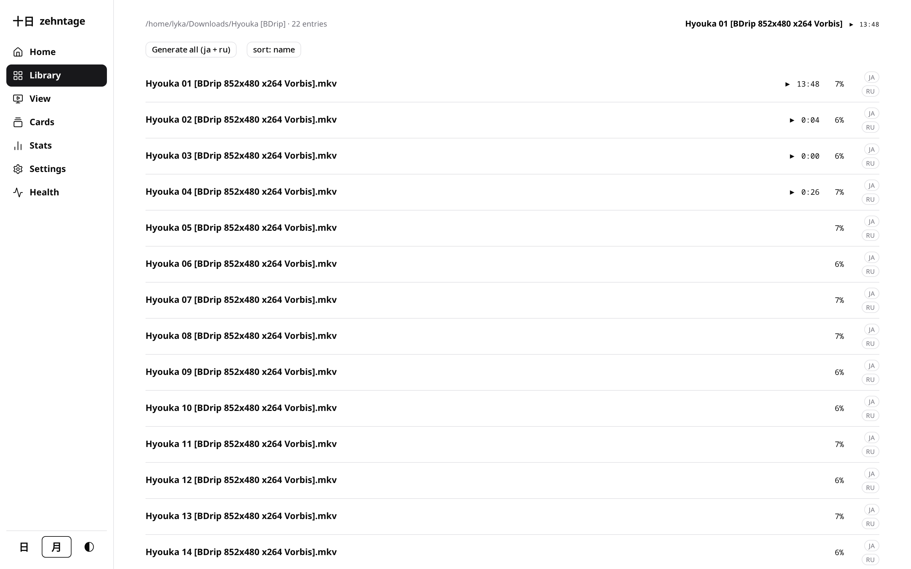
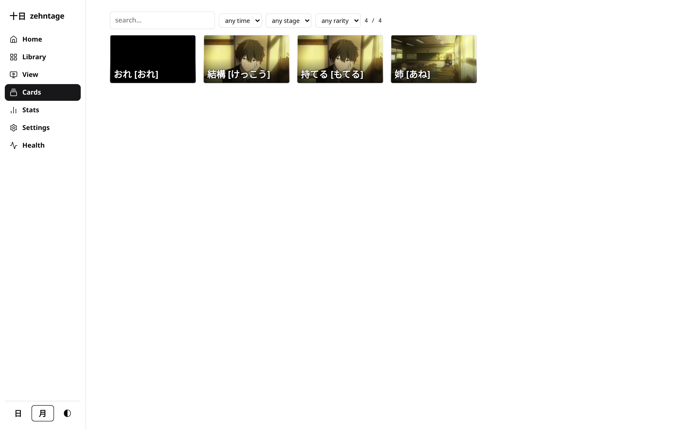
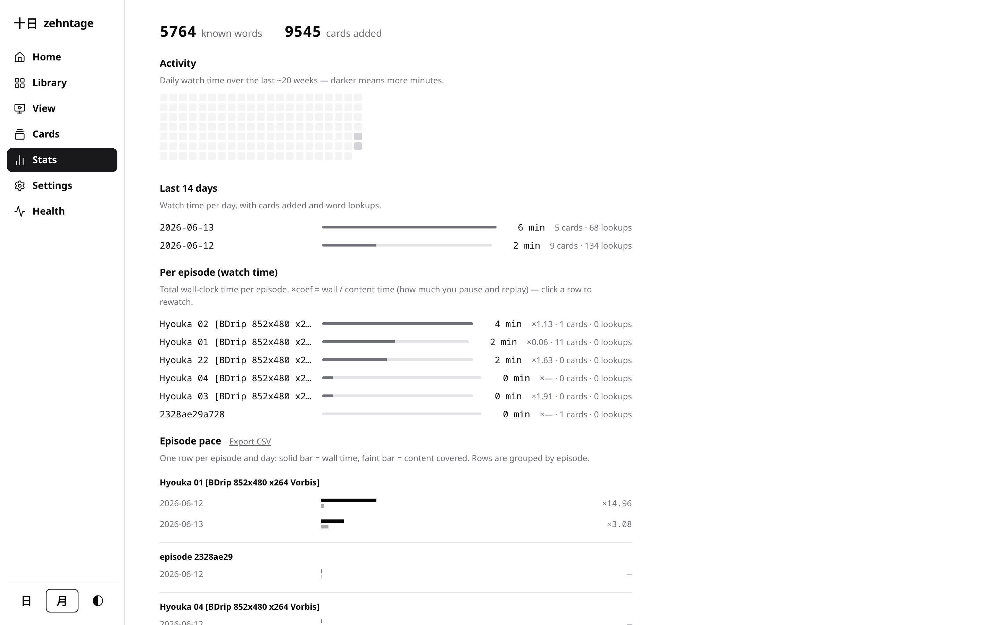
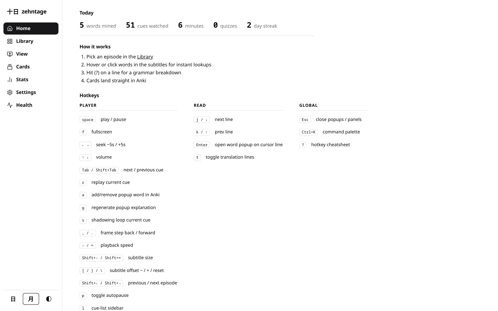
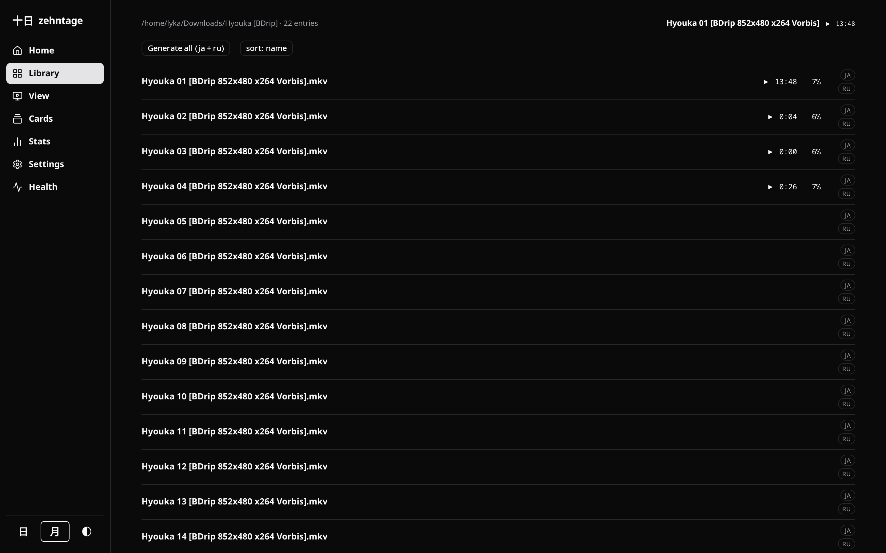
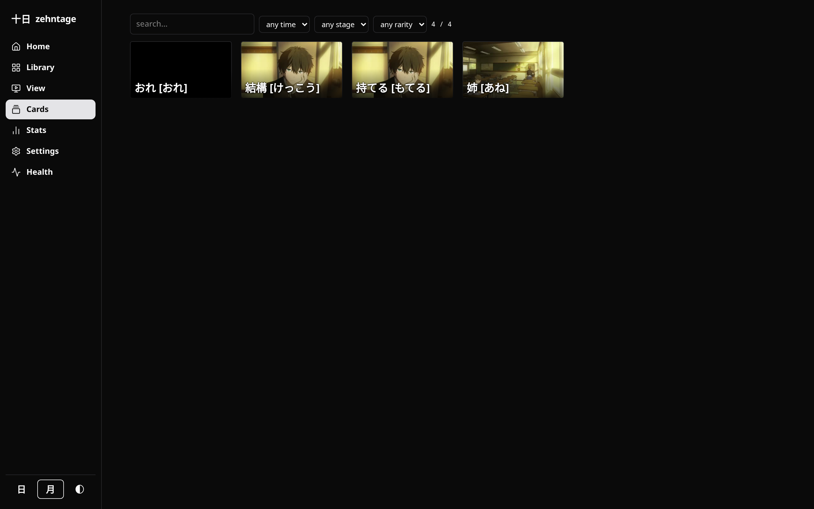

# 十日 zehntage-reactor

The minimalist local player that turns anime into your Anki deck.

A local, hotkey-first "Language Reactor for anime": play raw episodes, look up
words and sentences inline, and mine SRS cards (with video frame + sentence
audio) straight into Anki — all behind a calm, monochrome zen interface with
light, dark, and system themes.

## Screenshots

| | |
| --- | --- |
|  |  |
| Library — your episodes at a glance | Mined cards with frame + furigana |
|  |  |
| Stats — activity, pace, coverage | Home — hotkey-first cheatsheet |

Dark theme:

| | |
| --- | --- |
|  |  |

## Features

**Subtitle generation**
- Jimaku-first: fetches human Japanese subtitles from jimaku.cc automatically;
  falls back to local whisper large-v3 only when no confident match is found
- Whisper output is streamed live while transcribing, with anti-hallucination
  cleanup (repeated-cue runs on music/silence collapsed)
- Gemini proper-noun correction pass on whisper output — fixes misheard character
  and place names using the per-series glossary
- Gemini translation into your configured known language, generated and stored as
  a sidecar; on-demand "re-translate" per episode (Settings or command palette)

**Player**
- Gemini word and sentence lookups: hover/click a word for reading + notes,
  sentence explanations, AI translation into a synced secondary (blurred) line
- Seekbar: hover the progress bar to preview the subtitle line at that position
  (Japanese + Russian), alongside the difficulty heat strip; thin tick marks show
  i+1 cues (neutral) and due-word cues (accent color) — the SRS heatmap
- Shadowing loops, per-cue replay, smart autopause on lines with unknown words
- Comprehension quiz (`q`) over the cues you just watched; end-of-episode prompt
  (toggle in Settings → Player behavior)
- Echo dictation mode (`e`), picture-in-picture (`i`), session HUD (`o`)
- Deep links: `#/play/<id>@<seconds>` jumps straight into an episode

**Vocabulary & cards**
- Lemma-based vocabulary: clicking a conjugated form stores the dictionary lemma,
  so all inflections of a word highlight once a card exists; homograph-aware —
  辛い[からい] and 辛い[つらい] are keyed separately and never cross-match
- Word coloring by Anki interval: new words highlighted, learning words fade from
  blue to ambient as the SRS interval grows; furigana on unknown kanji
- Retention-decay coloring: overdue deck words are visibly tinted back toward red,
  ramping with true days-overdue (saturating ~2 weeks past due date)
- Due-word jump (`d`): skip to the next cue containing a word that is currently
  due for Anki review; "N due" indicator in the player HUD
- Person-name tokenizer merge: consecutive name tokens (e.g. 折木 + 奉太郎) are
  treated as one word for lookup and card mining
- Pre-study mode: bulk-add the unknown words of the upcoming minutes
- Anki integration: reads and writes go directly to `collection.anki2` on disk
  (no AnkiConnect required); one-click mining with video frame and sentence audio

**Search** (`#/search`)
- Global cross-episode subtitle search: type to query every episode's Japanese
  transcript via `GET /api/search`
- Results grouped by episode; keyboard nav with ↑/↓ to move, Enter to open,
  Esc to clear; matched substring highlighted
- Click or Enter deep-links straight into the player at the cue
- Also reachable from the sidebar nav and the Ctrl+K command palette
  ("search subtitles (jump to any line)")

**Review mode** (`#/review`)
- Hotkey-driven SRS review of your Anki due queue — Space to reveal, 1–4 to
  grade, R to replay audio, Delete to remove the note
- Reads and grades `collection.anki2` directly on disk — Anki does NOT need to
  be open (windowless / DB-direct); close Anki to review and sync windowlessly
- Two-column layout toggle for cards with a context image/sentence (persisted)
- While Anki is open: reads proceed (snapshot may lag); writes are refused and
  the UI tells you to close Anki

**UI**
- Three themes (light/dark/system) switchable from the sidebar 日/月/◐ buttons
- Command palette (Ctrl+K): fuzzy-search navigation, settings toggles, and deep
  player actions (copy cue, copy deep-link, generate/translate subtitles,
  jump due, open read mode, condensed audio…)
- Read mode: full transcripts with the same lookups, hotkeys, and encounter list
  (player↔read parity for the encounters block)
- Stats: activity grid, watch time, mining pace, per-episode coverage;
  **vocabulary growth chart** (`GET /api/stats/growth`) — cumulative words
  mined per day as a bar chart; shows total deck size on each day cards were added
- Home "Today" panel: words mined, cues watched, minutes, quizzes, daily streak
- **Immersion timer**: session HUD (`o`) shows focused watch time this session vs
  your daily minutes goal; configure the goal in Settings → "Daily immersion
  goal (minutes)" (stored in `localStorage` as `zr.goal.minutesPerDay`,
  default 30)

## Quickstart

```sh
bun install
bun run src/cli.ts /path/to/media/dir   # serves http://localhost:8417
```

Keys go in `~/.env` (names only — never commit values):

- `GEMINI_API_KEY` — word/sentence lookups, translation (into `knownLang`), proper-noun correction
- `JIMAKU_API_KEY` — jimaku.cc human subtitle fetch
- `ZEHNTAGE_ANKI_DB` — override the collection path (default: `~/.local/share/Anki2/User 1/collection.anki2`)
- `ZEHNTAGE_DB_TOKEN` — optional auth token for review/add/delete write endpoints
- `ZR_ANKI_BACKUP_DIR` — override the backup dir (default: `~/.local/share/zehntage/anki-backups/`)

Subtitle generation needs `ffmpeg` and `whisper-cli` (for the whisper fallback).
Other CLI modes: `subtitle <lang> [<lang2>] <file>`, `backup [<dir>]`, `backups`.

## Hotkeys

Bindings match physical keys (`e.code`), so they work on any layout.
`?` in the app shows the full cheatsheet, grouped by scope
(player / read / global) so dual-scope keys like `j` and `k` stay unambiguous.

Player scope:

| keys | action |
| --- | --- |
| space | play / pause |
| f | fullscreen |
| ← → | seek −5s / +5s |
| ↑ ↓ | volume |
| Tab / Shift+Tab | next / previous cue |
| r | replay current cue |
| s | shadowing loop current cue |
| a | add/remove popup word in Anki |
| g | regenerate popup explanation |
| , / . | frame step back / forward |
| - / = | playback speed |
| Shift+- / Shift+= | subtitle size |
| [ / ] / \\ | subtitle offset − / + / reset |
| Shift+← / Shift+→ | previous / next episode |
| p | toggle autopause |
| l | cue-list sidebar |
| w | pre-study panel |
| q | comprehension quiz |
| b / bb | peek translation / toggle blur |
| i | picture-in-picture |
| k | mark hovered word known |
| x | blacklist hovered word |
| o | session HUD overlay |
| e | echo dictation mode |
| j | jump to next i+1 cue |
| d | jump to next due-word cue |

Read scope:

| keys | action |
| --- | --- |
| j / ↓ | next line |
| k / ↑ | prev line |
| Enter | open word popup on cursor line |
| t | toggle translation lines |

Global scope:

| keys | action |
| --- | --- |
| Ctrl+K | command palette |
| ? | hotkey cheatsheet |
| Esc | close popups / panels |
| Enter / Space | review: check / next card |

Routes:

- `#/` — library / home
- `#/play/<id>` — player (deep-link: `#/play/<id>@<seconds>`)
- `#/review` — review / cram mode
- `#/read/<id>` — read mode
- `#/search` — global subtitle search
- `#/cards` — mined cards
- `#/stats` — stats dashboard
- `#/settings` — settings
- `#/health` — debug / observability

## Architecture

- Bun server (`src/server/index.ts`) + React SPA (`web/`), hash routing
- Sidecar subtitles: `subs/<base>.<lang>.srt` next to each video
- Config + synced `zr.*` state: `~/.config/zehntage-reactor`
  (override with `ZR_CONFIG_DIR`)
- Telemetry, backups, and snapshots: `~/.local/share/zehntage-reactor`
- Pure logic lives in `src/lib/` and `web/*.ts`, bun-testable without DOM
- Web layer decomposed into focused route files (`HomeRoute`, `LibraryRoute`,
  `CardsRoute`, `StatsRoute`, `SettingsRoute`, `ReviewRoute`, `ReadRoute`,
  `SearchRoute`)
  and player hooks (`useWordState`, `useLookup`, `useActiveCues`, `useAutoNext`,
  `useEcho`, `useHotkeys`, `useSession`, `useSubControls`, …)

## Data export & import

Settings → `~/.config/zehntage-reactor/settings.json`. Synced state
(known words, blacklist, resume/reading positions) →
`~/.config/zehntage-reactor/state.json`. Telemetry →
`~/.local/share/zehntage-reactor/events.jsonl`.

The Settings page has **Export data (JSON)** (downloads a
`{ version, exportedAt, settings, state, events }` bundle) and
**Import data (JSON)** (merges settings + state via last-write-wins;
events are skipped by default). Endpoints: `GET /api/export`,
`POST /api/import`.

**Auto-backup snapshots** are taken automatically on server startup (throttled to
at most one per 6 hours) and stored as timestamped JSON files in
`~/.local/share/zehntage-reactor/snapshots/`. Restore any snapshot via
Settings → Snapshots picker or `POST /api/snapshots/restore`.

## Development

Gates before shipping:

```sh
bunx tsc --noEmit
bun test
bun run build:web
bun run test:e2e
```

E2E (Playwright) runs against port 8499 with `GEMINI_FAKE=1`,
`WHISPER_FAKE=1`, `ANKI_FAKE=1` — no real keys or Anki needed.

## Attribution

- Pitch accent data: [Kanjium](https://github.com/mifunetoshiro/kanjium) (Uros O.), CC BY-SA 4.0
- Word frequency list: Leeds corpus, CC BY
- Icons: [Lucide](https://lucide.dev), ISC
